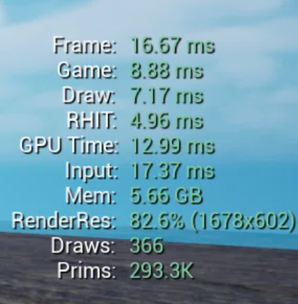
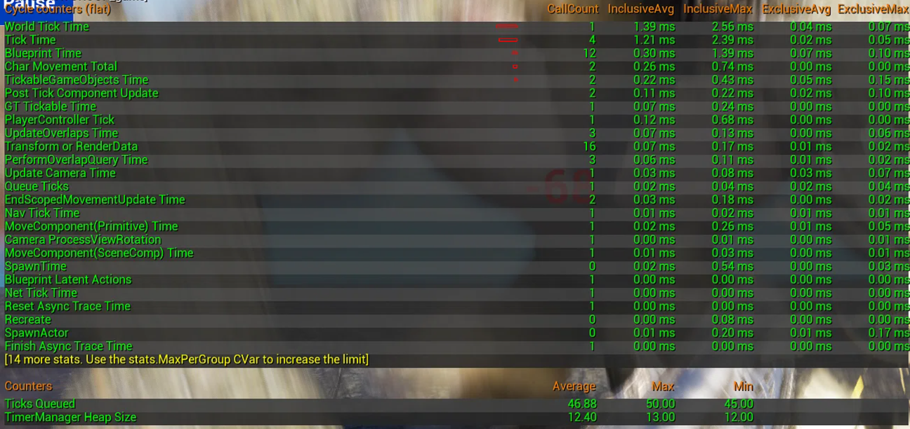
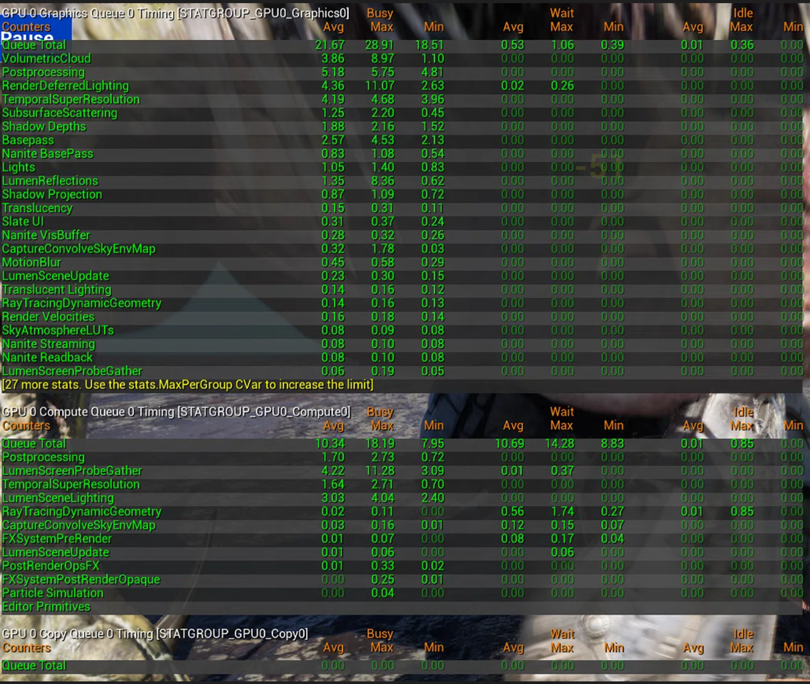
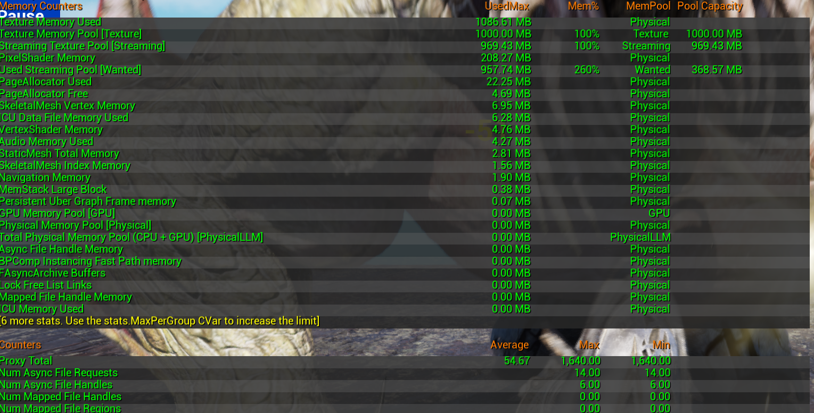

# RPGBattlePrototype 性能观察报告

> **运行版本**：V2.0  
> **日期**：2026.09.06  
> **工具**：`stat unit`、`stat game`、`stat gpu`、`stat memory`  
> **测试环境**：Windows 11 / Unreal Engine 5.7 / Development Build（PIE）  

## 1. 概述

本报告记录了 RPGBattlePrototype V2.0 在完整 Boss 战流程下的性能基线数据，用于评估当前版本是否存在明显性能瓶颈，并作为后续优化工作的参考基准。

测试结论：**当前 Demo 在核心战斗场景中帧率稳定在 60fps，各项核心指标均在合理范围内，无性能瓶颈。**

### 1.1 执行摘要

- **帧率**：Development PIE 下稳定 60fps，无掉帧或卡顿
- **瓶颈线程**：GPU（12.99ms），Game 线程余量约 7.8ms，Draw 线程余量约 9.5ms
- **GPU 热点**：Lumen（~8.6ms）+ 后处理（~6.9ms），两者约占 GPU 总时间的 70-80%
- **蓝图效率**：Blueprint Time 仅 0.30ms，逻辑层无明显开销
- **内存**：纹理池已占满（100%），但主要纹理尺寸在合理范围内（角色/Boss 2048×2048，场景 1024×1024），无异常累积
- **结论**：当前无需紧急优化，GPU 侧存在 2 个明确的优化方向（Lumen 降级、后处理瘦身）

## 2. 性能测试结果

### 2.1 stat unit（整体帧耗时）

| 指标     |   数值   | 60fps 阈值 | 状态   |
| :------- | :------: | :--------: | :----- |
| Frame    | 16.67 ms |  16.67 ms  | ✅ 达标 |
| Game     | 8.88 ms  |  16.67 ms  | ✅ 达标 |
| Draw     | 7.17 ms  |  16.67 ms  | ✅ 达标 |
| GPU Time | 12.99 ms |  16.67 ms  | ✅ 达标 |
| RHIT     | 4.96 ms  |     —      | ✅ 正常 |

**其他信息**：
- `Draws`：366
- `Prims`：293.3 K
- `RenderRes`：82.6%（1678×602）

三项核心指标均在 16.67ms 以内，帧率稳定在 60fps。Draw Calls 为 366，处于较低水平，无渲染瓶颈。

### 2.2 stat game（Game 线程细分）

Game 线程总耗时 8.88ms，主要分项如下：

| 统计项                  | 平均值  | 状态 |
| :---------------------- | :-----: | :--- |
| WorldTickTime           | 1.39 ms | 正常 |
| TrickTime               | 1.21 ms | 正常 |
| Blueprint Time          | 0.30 ms | 正常 |
| CharMovement Total      | 0.26 ms | 正常 |
| TickableGameObjectsTime | 0.22 ms | 正常 |
| PlayerControllerTick    | 0.12 ms | 正常 |
| NavTickTime             | 0.01 ms | 正常 |
| UpdateOverlapsTime      | 0.07 ms | 正常 |

各分项均未出现异常偏高的情况，蓝图与 AI 模块开销处于合理范围。

### 2.3 stat gpu（GPU 线程细分）

GPU 总耗时 12.99ms，主要 Pass 如下：

**Graphics Queue**

| 渲染 Pass               | 平均值  | 状态 |
| :---------------------- | :-----: | :--- |
| Postprocessing          | 5.18 ms | 正常 |
| RenderDeferredLighting  | 4.36 ms | 正常 |
| TemporalSuperResolution | 4.19 ms | 正常 |
| VolumetricCloud         | 3.86 ms | 正常 |
| Basepass                | 2.57 ms | 正常 |
| ShadowDepths            | 1.88 ms | 正常 |
| LumenReflections        | 1.35 ms | 正常 |
| SubsurfaceScattering    | 1.25 ms | 正常 |

**Compute Queue**

| 渲染 Pass               | 平均值  | 状态 |
| :---------------------- | :-----: | :--- |
| LumenScreenProbeGather  | 4.22 ms | 正常 |
| LumenSceneLighting      | 3.03 ms | 正常 |
| Postprocessing          | 1.70 ms | 正常 |
| TemporalSuperResolution | 1.64 ms | 正常 |

各渲染 Pass 耗时均在合理范围内，无单 Pass 超时现象。Lumen 相关开销处于 UE5 默认场景的正常水平。GPU 整体负载均衡。

### 2.4 stat memory（内存概览）

| 统计项                 |        数值        | 说明                         |
| :--------------------- | :----------------: | :--------------------------- |
| Texture Memory Used    |     108.61 MB      | 当前纹理内存使用量           |
| Texture Memory Pool    | 1000.00 MB（100%） | 纹理内存池总容量，已全部占用 |
| Streaming Texture Pool | 969.43 MB（100%）  | 流送纹理池总容量，已全部占用 |
| PixelShader Memory     |     208.27 MB      | 像素着色器内存占用           |

纹理内存池和流送纹理池已占满为正常现象，引擎会按需分配和释放内存，当前数值未超出正常范围。

**静态检查**：主要纹理（角色、Boss、场景地板）的 Max Texture Size 均在合理范围内（2048×2048 以内），未发现异常高分辨率纹理被误导入。

### 2.5 瓶颈定位

根据 `stat unit` 数据，当前瓶颈线程为 **GPU（12.99ms）**，Game 线程（8.88ms）余量约 7.8ms，Draw 线程（7.17ms）余量约 9.5ms。

GPU 侧热点集中在：

| 热点模块       | 估算占比 | 说明                                            |
| :------------- | :------: | :---------------------------------------------- |
| Lumen 全局光照 |   ~60%   | ScreenProbeGather + SceneLighting + Reflections |
| Postprocessing |   ~30%   | 含后处理各 Pass                                 |

两者合计占 GPU 总时间约 **70-80%**。对于 1v1 战斗原型而言，Lumen 与完整后处理管线属于过度配置，存在明显的优化空间。

## 3. 结论

| 检查项     |     结果     | 说明                                  |
| :--------- | :----------: | :------------------------------------ |
| 帧率       | ✅ 稳定 60fps | 三项指标均 < 16.67ms                  |
| Game 线程  |    ✅ 正常    | 8.88ms，余量充裕                      |
| GPU        |    ✅ 达标    | 12.99ms，最低余量，可作为后续优化方向 |
| Draw Calls |    ✅ 健康    | 366，远低于警戒线                     |
| 内存       |    ✅ 正常    | 纹理池占满为 UE5 常态，无异常累积     |
| 纹理尺寸   |    ✅ 正常    | 已检查主要纹理，分辨率合理            |

GPU 为当前瓶颈线程（12.99ms），但帧率稳定达标，暂无紧急优化必要。Game 线程余量充裕（7.8ms），后续若增加粒子、AI 等逻辑负载，Game 线程仍有足够余量承载。

## 4. 后续方向

### 4.1 Lumen 全局光照

`stat gpu` 数据显示 Lumen 相关 Pass 占 GPU 时间约 60%，是当前最大的单项开销。

当前场景为 1v1 Boss 战，战斗区域固定，光照环境在整场战斗中不会发生变化。Lumen 的动态全局光照能力在这个场景中未产生实际收益，但持续占用 GPU 预算。

后续可以考虑：
- 将 Lumen 品质从 High 降至 Medium
- 或完全关闭 Lumen，改用烘焙静态光照

### 4.2 后处理管线

Postprocessing 占 GPU 时间约 30%，主要消耗来自 Motion Blur、Depth of Field 等效果。

后续可以考虑：
- 移除 Motion Blur
- 移除 Depth of Field
- Bloom 和 Tone Mapping 保留

### 4.3 纹理流送

纹理池和流送池均已占满，当前项目资源量下未出现卡顿，但如果后续增加更多 Boss 或场景资源，可能会触发动态换页开销。

后续可以考虑：
- 根据实际显存调整 `r.Streaming.PoolSize`
- 检查新增纹理的导入设置，避免 4K 纹理被误导入

### 4.4 Shipping 版本复测

本次测试在 Development PIE 环境下进行，调试符号和额外日志会对性能产生一定影响。

后续可以考虑：

+ 打包 Shipping 版本，关闭 VSync，固定 1080p / 100% Render Scale 后复测，获取更接近真实运行环境的性能基线。

**报告版本**：V1.0  
**最后更新**：2026.09.06