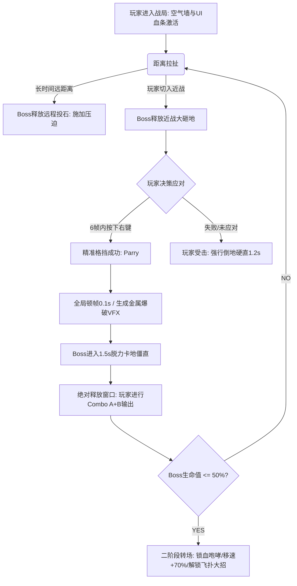
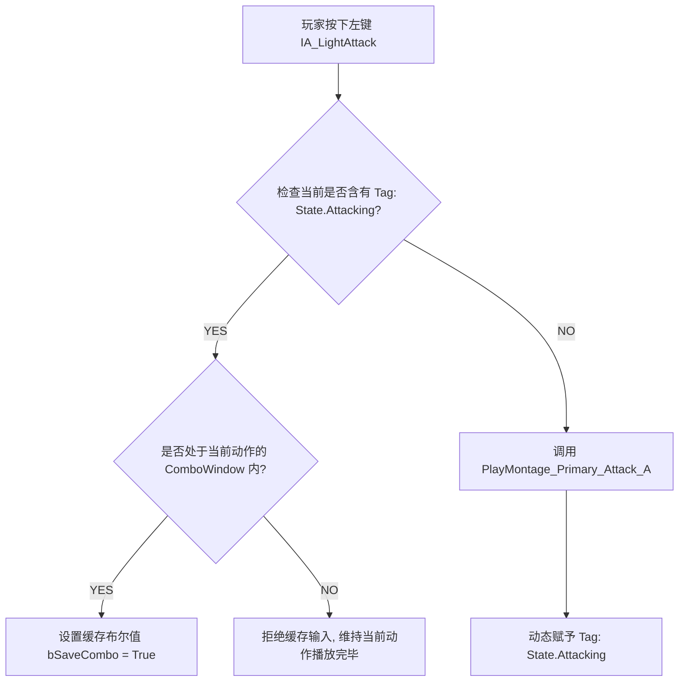
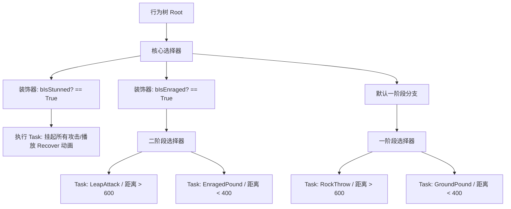
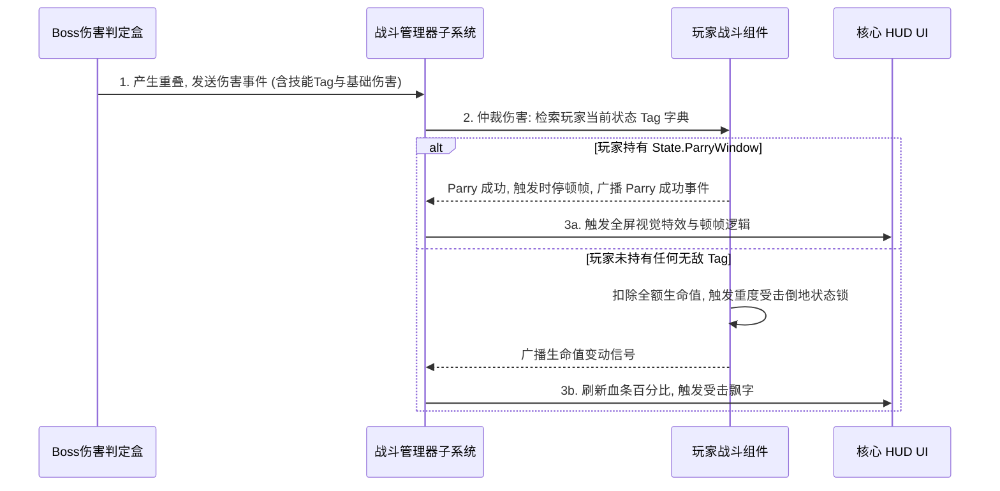

# 基于 GAS 与行为树的近战动作 RPG 战斗原型 (RPGBattlePrototype)

> **项目状态**：`draft_v2.0` 设计草案
> **实现方案**：数据驱动设计 / 事件解耦管线 / 状态机与标签矩阵控制

## 1. 项目简介与研发目标

本项目使用虚幻引擎 5（UE5）完成一个 1v1 近战首领战（Boss战）的核心玩法原型。研发过程中遵循 MVP（最小可行性产品）开发原则，不包含背包、关卡、任务等外围系统，集中于动作博弈、蓝图/C++ 混合架构以及数据配置管线的实现。

### 技术要点
1. **数据与表现解耦**：采用全局事件订阅子系统，隔离伤害结算与 UI 刷新逻辑。
2. **帧级精准格挡（Parry）**：利用 `AnimNotifyState` 在动画帧内建立严格的时间窗防御判定，结合 GameplayTag 矩阵实现受击反馈。
3. **数据驱动配置**：基于虚幻原生 `PrimaryDataAsset` 组织首领招式与数值配置，方便后续扩展。

---

## 2. MVP（最小可行性产品）取舍原则

为了在 20 天内完成核心内容的开发并保证功能闭环，项目进行了明确的功能剪裁：

### 2.1 功能保留项
* **战斧两连击 Combo**：仅保留 `Primary_Attack_A` 与 `B`，简化动画状态机与输入缓存逻辑。
* **帧级 Parry（精准格挡）**：实现判定时间窗、顿帧（Time Dilation）以及 Boss 脱力僵直状态锁。
* **DataAsset 数据驱动**：使用 `PrimaryDataAsset` 存储单 Boss 的招式数值、冷却和蒙太奇指针。
* **Leap（飞扑）招式**：二阶段核心招式。采用“锁定玩家实时坐标 ➔ 飞扑位移 ➔ 触发落地 AOE”的直击方案。
* **行为树 AI 与二阶段流转**：保留一阶段双足慢跑、二阶段四足狂奔、锁血咆哮转场的行为树管线。

### 2.2 功能剪裁项
* **战斧三连击**：去掉第三段劈砍，减少连续输入容错与多段判定框偏移的处理成本。
* **普通格挡与耐力值系统**：不做普通挡格减伤及耐力（Stamina）扣减机制，博弈保留“精准格挡，翻滚闪避，受击倒地”。
* **EQS（环境查询系统）**：不用行为树中的 EQS 网格射线扫描，避免复杂的边界碰撞调试。
* **杂兵与升级系统**：去掉刷怪点、属性刷新及升级 UI，开局直接切入 Boss 战。

---

## 3. 核心 Gameplay 循环架构

整个战斗循环围绕“施压 ➔ 应对 ➔ 释放 ➔ 阶段流转”的逻辑构建：



## 4. 玩家系统设计 (Player System)

### 4.1 类设计与职责边界：`BP_PlayerCharacter`

- **核心职责**：承载物理胶囊体碰撞、基础移动组件（CharacterMovement）；接收增强输入映射；驱动动画状态机并挂载 `UActorComponent_Combat`（战斗组件）管理生命值。  
- **边界红线**：不负责 UI 的绘制与刷新，血条和顿帧视觉效果由其通过事件异步广播，由 UI 监听器独立处理。  

### 4.2 战斧两连击 Combo 系统实现管线

将连击精简为 A -> B 两连击，利用 `AnimNotifyState` 在动画帧内管理输入缓存。  



- **`Primary_Attack_A`（全长 45 帧）动画内部配置**：
  - **第 15 - 35 帧**：配置 `AnimNotifyState_ComboWindow`。在此区间内按下左键，将 `bSaveCombo` 设为 True。  
  - **第 20 帧**：配置 `AnimNotify_ApplyDamage`。调用 `GetSocketLocation` 触发球体武器射线检测。  
  - **第 36 帧**：配置 `AnimNotify_ComboCheck`。若 `bSaveCombo == True`，则立刻调用 `PlayMontage(Primary_Attack_B)` 并将 `bSaveCombo` 复位；若为 False，则动作自然播放至结束，并在动画结束通知中清除 `State.Attacking` 标签。  

### 4.3 帧级 Parry（精准格挡）实现

当玩家按下右键（`IA_Parry`）时，系统驱动角色播放举盾动画蒙太奇：

- **第 1 - 6 帧**：配置 `AnimNotifyState`，动态赋予玩家 `State.ParryWindow` 标签。若在此 6 帧内重叠了 Boss 攻击判定盒，则判定精准格挡成功。  
- **第 7 帧起**：该标签被自动剥离。若在此之后重叠了 Boss 攻击判定盒，则判定防御失败，执行普通受击反应。  
- **边缘情况防刷新漏洞**：若在前 6 帧内玩家松开了右键，系统通过 `OnInputReleased` 强行中断动画，清除 `State.ParryWindow`，防止通过高频重复输入刷新 Parry 窗口。  

## 5. 首领 AI 系统设计 (Boss System)

### 5.1 行为树（Behavior Tree）架构

Boss AI 不在 Tick 中计算距离，通过独立的黑板变量与行为树任务进行空间决策。  

代码段



### 5.2 核心技能逻辑实现

1. **碎裂裂地砸 (GroundPound)**：在蒙太奇第 33 帧（双拳触地瞬间），调用 `AnimNotify_SpawnOverlapBox` 在地面生成半径 350 码的伤害区。命中无无敌标签的玩家将施加重度受击。第 34 帧调用 `AnimNotify_SetStunLock`，将黑板值 `bIsStunned` 改为 True，顺接进入 1.5 秒的脱力卡地状态。  
2. **远古巨石投掷 (RockThrow)**：当距离 > 600 时触发。在前 20 帧播放拔石动画，并在右手骨骼挂点上生成一个岩石子弹类；第 30 帧通过通知激活岩石的 `ProjectileMovement` 组件向玩家坐标抛射。  
3. **二阶段飞扑 (Leap Attack)**：Boss 血量低于 50% 触发锁血咆哮并切入四足姿态（移速提至 600.0f）。触发飞扑时，AI 瞬时锁定玩家坐标写入黑板，播放起跳动画并关闭与玩家的胶囊体碰撞，平滑位移到目标点，落地触发 500 码范围伤害红圈。  

## 6. 数据驱动与标签字典

项目采用虚幻原生 `PrimaryDataAsset` 与 `GameplayTag` 字典进行配置。  

### 6.1 `PDA_BossSkillData`（数据资产结构）

```
UPROPERTY(EditDefaultsOnly, Category = "Combat")
FGameplayTag SkillTag;          // 技能唯一标识

UPROPERTY(EditDefaultsOnly, Category = "Combat")
float BaseDamage;               // 该招式基础伤害

UPROPERTY(EditDefaultsOnly, Category = "Combat")
float Cooldown;                 // 招式内置CD

UPROPERTY(EditDefaultsOnly, Category = "Combat")
UAnimMontage* AnimationMontage; // 绑定的动画蒙太奇
```

### 6.2 核心 GameplayTag 字典

- `State.Attacking`：角色正在攻击中，用以互斥其他动作输入。  
- `State.ParryWindow`：玩家处于精准格挡的有效范围内。  
- `State.Dashing`：玩家处于翻滚闪避中，物理碰撞盒临时关闭。  
- `State.Disabled`：角色处于倒地、强直等卡死状态，屏蔽一切控制权。  
- `Tag.Boss.Skill.Heavy`：对应 Boss 的砸地或飞扑，命中后强行打断玩家并触发倒地。  
- `Tag.Boss.State.Vulnerable`：Boss 僵直期间的易伤标记（受击增伤 30%）。  

## 7. 模块解耦：伤害结算管线

为了避免 `BP_PlayerCharacter` 与 `BP_BossCharacter` 之间产生双向引用，伤害判定与 UI 刷新流程通过全局事件订阅机制完成。  



## 8. 仓库目录结构规范

```
Content
├── _ProjectCore
│   ├── Architecture    # 核心解耦类、Combat组件、全局事件管理器
│   ├── Input           # 增强输入映射 (Input Mapping Context / Input Actions)
│   └── System          # DataAsset定义、GameplayTag字典
├── Characters
│   ├── Player_Terra    # 玩家资产 (动画、材质、核心控制蓝图)
│   └── Boss_Rampage    # Boss资产 (动画、AI行为树、黑板、BTTasks)
└── UI
    └── WBP_HUD_Main   # 双人血条与伤害飘字组件
```

## 9. 20天工程排期表

| **天数**   | **核心研发模块** | **每日进度控制点**                                           |
| ---------- | ---------------- | ------------------------------------------------------------ |
| **Day 1**  | 项目初始化       | 新建空项目，导入 Terra 与 Rampage 资产。建立文件夹结构规范。 |
| **Day 2**  | 玩家基础移动     | 配置增强输入（IA_Move/IA_Dash），连通基础八向跑步与移动组件。 |
| **Day 3**  | 普攻第一击       | 串连 `Primary_Attack_A` 蒙太奇，实现基础球体武器射线伤害检测。 |
| **Day 4**  | 攻击Combo链      | 编写 `AnimNotifyState_ComboWindow`，实现A动作顺接B动作的输入缓存。 |
| **Day 5**  | 闪避无敌帧       | 连通闪避动画，通过动画通知在指定帧临时关闭玩家胶囊体的重叠检测。 |
| **Day 6**  | **验证节点一**   | **测试点**：放置静态肉靶小怪，测试“两连击 Combo ➔ 闪避”手感，确保无报错。 |
| **Day 10** | 受击矩阵联动     | 导入受击倒地蒙太奇，连通重度伤害事件下玩家强行中断当前动作并倒地的逻辑。 |
| **Day 11** | **验证节点二**   | **测试点**：手动触发肉靶攻击，调试“帧级 Parry 反制”与“受击倒地”的判定窗。 |
| **Day 12** | AI 行为树奠基    | 建立行为树与黑板。完成 Boss 体型配置与基础的一阶段慢跑追击 Task。 |
| **Day 13** | AI 近战砸地      | 编写近战任务。连通触地红圈判定与 Boss 1.5 秒脱力僵直锁逻辑。 |
| **Day 14** | AI 远程投石      | 编写远程拔石头与抛射子弹类逻辑，在黑板配置大于 600 码距离时自动触发。 |
| **Day 15** | 转场与二阶段暴走 | 连通血量低于 50% 触发二阶段转场的逻辑，实现锁血咆哮及移速动态提速。 |
| **Day 16** | 基础飞扑招式     | 编写飞扑任务，直接获取玩家瞬时坐标进行平滑位移，完成落地 AOE 判定。 |
| **Day 17** | **验证节点三**   | **测试点**：跑通完整的“一阶段远近拉扯 ➔ 二阶段暴走飞扑”AI 战斗循环。 |
| **Day 18** | 数据资产重构     | 将 Boss 的伤害、冷却、蒙太奇抽取到 `PrimaryDataAsset` 中，完成数值解耦。 |
| **Day 19** | 核心血条 HUD     | 接入血条 UI。微调顿帧时间，确保博弈节奏。                    |
| **Day 20** | **打包与交付**   | **冻结代码。打包 Standalone 版本。录制实机演示视频。**       |

## 10. 风险控制与应急规避预案

- **风险 A：投石动画骨骼挂点偏移导致石头生成位置错误，或者抛射体物理碰撞出现死角。**
  - **规避预案**：若该模块调试超过 4 小时，启动 B 方案：砍掉物理子弹类。改为：Boss 播放远程咆哮，直接获取玩家脚下坐标生成警示红圈，0.5 秒后召唤雷击伤害。该方案保留了“远距离拉扯惩罚”的机制核心[cite: 2]。
- **风险 B：Parry 判定因游戏帧率不稳定，导致在 Tick 检测中漏判。**
  - **规避预案**：不在 Tick 中累加时间或使用标准计时器[cite: 2]。依赖动画通知状态（`AnimNotifyState`）的 `NotifyBegin` 与 `NotifyEnd` 接口直接对 Character 的标签字典进行“赋予”与“剥离”操作，使判定窗与动画渲染同步[cite: 2]。